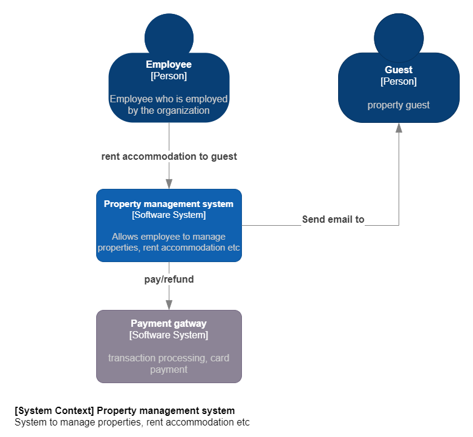

# Property Management system

## Table of Contents

* [General Info](#general-information)
* [Technologies Used](#technologies-used)
* [Features](#features)
* [Architecture diagram](#architecture-diagram)

## General Information

The goal of the project was to write Engineer's Thesis.

The project is about designing and implementing the backend of a hotel management
system. Firstly, a project analysis was carried out, which involved documenting the
requirements that the system must meet. The most crucial requirements were related to
registration and reservation management. System was presented using C4 diagrams, such as: context, containers, and
components. Subsequently, architectures were described such as layered and hexagonal,
for creating components.

## Technologies Used

- Spring Boot 3.1
- PostgreSQL 13

## Features

System has 2 main functions: registration and reservation. 
 * Registration is the procedure during which the guest formally signs up to stay at the property. During this procedure, the guest provides the necessary information, such as: personal information, contact information, type of accommodation. After registration, the hotel assigns the guest specific accommodation to which he is granted access for a specific period of time.
 * Reservation is procedure during which the guest makes a notification of potential stay in the property. During this procedure, the guest provides information, such as: dates of stay, type of accommodation number of guests.

## Architecture diagram

Diagram C4 - context level

Diagram C4 - containers level

