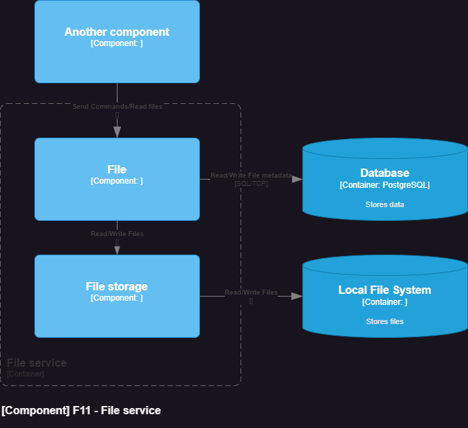

# File service

## Table of Contents

* [General Info](#general-information)
* [Technologies Used](#technologies-used)
* [Features](#features)
* [Architecture diagram](#architecture-diagram)
* [Build](#build)
* [Test](#test)

## General Information

Purpose of project was to try build module that store files.
It is only on local file system at this moment, but can easily be changed to AWS S3(I think :D).

## Technologies Used

- Spring Boot 3.1.1

## Features

* File_storage feature - works on local file system and allows files to:
    * save
    * get
    * delete
* File module feature - uses File_storage and database to offer a better API to work with.

## Architecture diagram

Diagram C4 - component level

## Build

1. Build this module:

        .\gradlew :service:file-module:build

## Test

1. Execute unit and integration tests:

        .\gradlew :service:file-module:test
