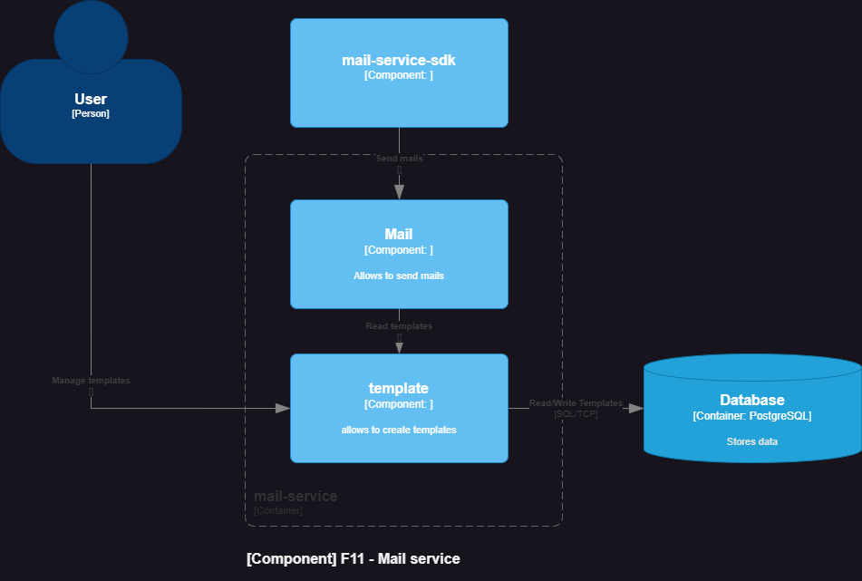

# Mail

## Table of Contents

* [General Info](#general-information)
* [Technologies Used](#technologies-used)
* [Features](#features)
* [Architecture diagram](#architecture-diagram)
* [Build](#build)
* [Test](#test)

## General Information

Purpose of project was to build two modules: first that would send mail and second that would provide sdk.

## Technologies Used

- Spring Boot 3.1.1
- Spring Email
- Thymeleaf

## Features

* mail-service module - allows to create templates and send mails.
* mail-service-sdk module - simple sdk, that provide one service to call mail-service application.

## Architecture diagram

Diagram C4 - mail-service - component level


## Build

1. Build this module:

        .\gradlew :service:mail:mail-service:build

## Test

1. Execute unit and integration tests:

        .\gradlew :service:mail:mail-service:test

## Usage

1. Bean definition

```java
import com.fasterxml.jackson.databind.ObjectMapper;
import lombok.AllArgsConstructor;
import org.springframework.beans.factory.annotation.Value;
import org.springframework.context.annotation.Bean;
import org.springframework.context.annotation.Configuration;
import pl.app.mail.sdk.SendMailHttpClient;

import java.net.http.HttpClient;

@Configuration
public class MailConfig {
    @Value("${app.mail.base-url:http://localhost:9000/api/v1}")
    private String sendMailServiceURI;
    @Value("${spring.application.name:test-service}")
    private String applicationName;

    @Bean
    public SendMailHttpClient sendMailHttpClient() {
        return new SendMailHttpClient(
                new ObjectMapper(),
                HttpClient.newBuilder().build(),
                sendMailServiceURI,
                applicationName
        );
    }
}
```

1. Service usage

```java
private final SendMailHttpClient sendMailHttpClient;

public void method(){
        // ...
        SendMailCommand command=SendMailCommand.builder()
        .to("dawidbladek0831@gmail.com")
        .subject("testSubject")
        .templateName("testTemplateName")
        .properties(List.of(new SendMailCommand.Property("link","localhost")))
        .build();
        sendMailHttpClient.sendMailAsync(command);
        // ...
}
```