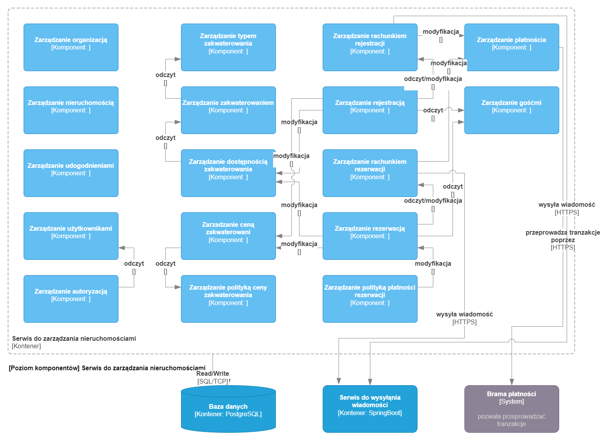

# property management service

## Table of Contents

* [General Info](#general-information)
* [Technologies Used](#technologies-used)
* [Features](#features)
* [Architecture diagram](#architecture-diagram)
* [Build](#build)
* [Test](#test)

## General Information

The goal of the application was to meet requirements of the system. 

## Technologies Used

- Spring Boot 3.1.4
- PostgreSQL 13

## Features

Service has 17 features that are grouped into 7 logical groups:
* **user management area**:
    * **user management**:
      * allows to 
        * create users,
        * add/remove privileges,
        * add/remove user from organization/property.
    * **authentication management**:
      * just user authentication process.
* **organization management area**:
    * **organization management**:
      * organization is collection of properties. Organization is logical container on which almost all functions in the system are performed.
      * allows to:
        * create/update/delete organizations.
    * **property management**:
      * property is a generalization of hotel. A property can be called any physical facility and its personel. This can include a variety of forms, such as: hotels, apartments, hostels, etc..
      * allows to:
        * create/update/delete properties.
    * **amenity management**
      * amenity describe property
      * allows to:
        * add/remove amenity from property,
        * active/deactivate standard amenities in organization,
        * create/delete custom amenities.
* **guest management**
  * guest is a customer, person to whom accommodation will be rented.
  * allows to:
    * create/update/delete guest profile.
* **accommodation management area:**
  * **accommodation management**
    * accommodation is a generalization of room. Accommodation represent a specific physical object, which is described by the type of accommodation.
    * allows to:
      * add/remove accommodation.
  * **accommodation type management**
    * accommodation type is a description of accommodation. More specifically describes the place which can be used for accommodation or housing.
    * accommodation type usually describe a single room, but can: group of rooms, a single bed or even entire property.
    * for example: if there are 4 equal rooms, then there will be one **accommodation type** and 4 **accommodations** of this type. 
    * allows to:
      * create/update/delete accommodation type.
  * **accommodation availability management**
    * its purpose is to answer the question "Is this accommodation available on given day?",
    * allows to:
      * check accommodation availability,
      * check accommodation type availability,
      * reserve accommodations,
      * reserve accommodation types - means that not specific accommodation is reserved but just one of available accommodation of given accommodation type.
      * change reservation status,
      * automatic/manual assignation accommodation type reservation to accommodation,
      * unassign accommodation type reservation.
  * **accommodation price management**
    * its purpose is to answer the question "What is the price of accommodation on given day?".
    * allows to:
      * calculate price
      * active/deactivate price policies
  * **accommodation price policy management**
    * polices show changes in the price of the type of accommodation, which depend on a number of variables, such as:
      * number of booked accommodations,
      * day of stay:
        * day of the week,
        * season of the year.
      * number of days of stay,
      * the reservation time creation,
      * occupancy:
        * of the property,
        * of a given type of accommodation.
      * number of guests.
    * based on these variables, price of accommodation can go up or down.
    * allows to:
      *  create/update/delete selected accommodation price polices.
* **payment management**
  * mediating between the application and a third-party payment system.
* **registration management area:**
  * Registration is the procedure during which the guest formally signs up to stay at the property. During this procedure, the guest provides the necessary information, such as: personal information, contact information, type of accommodation. After registration, the hotel assigns the guest specific accommodation to which he is granted access for a specific period of time.
  * **registration management**
    * registration is a collection of parties,
    * parties is a collection of guest and bookings,
    * each party has its own folio.
    * allows to:
      * create registration
      * change registration status:
        * confirm
        * cancel
        * finish
      * manage parties:
        * add/remove party,
        * add/remove booking,
        * add/remove guest from party.
  * **registration folio management**
    * folio contains details of all payments and charges related to stay, such as:
      * accommodation charges,
      * food, etc..
    * allows to:
      * manage party folio:
        * add/remove party folio,
        * add/remove charges, 
        * add payments.
      * refund payments,
      * start registration payment by mail.
* **reservation management area:**
  * Reservation is procedure during which the guest makes a notification of potential stay in the property. During this procedure, the guest provides information, such as: dates of stay, type of accommodation number of guests.
  * **reservation management**
    * reservation is collection of guest and bookings,
    * allows to:
      * create reservation,
      * change reservation status:
        * confirm,
        * finish,
        * reject:
          * no paid reservations,
          * no confirmed reservations.
  * **reservation folio management**:
    * allows to:
      * check if reservation is paid,
      * add/remove charges,
      * add payment,
      * start reservation payment by mail.
  * **reservation payment policy management**
    * policy decide whether a reservation must be paid before registration, how many days before registration must be paid and how much.
    * allows to:
      * change number of days before registration,
      * change status to:
        * none,
        * first day,
        * full.

## Architecture diagram

Diagram C4 - component level

## Build

1. Build this module:

        .\gradlew :service:property:property-service:build

## Test

1. Execute tests:

        .\gradlew :service:property:property-service:test
